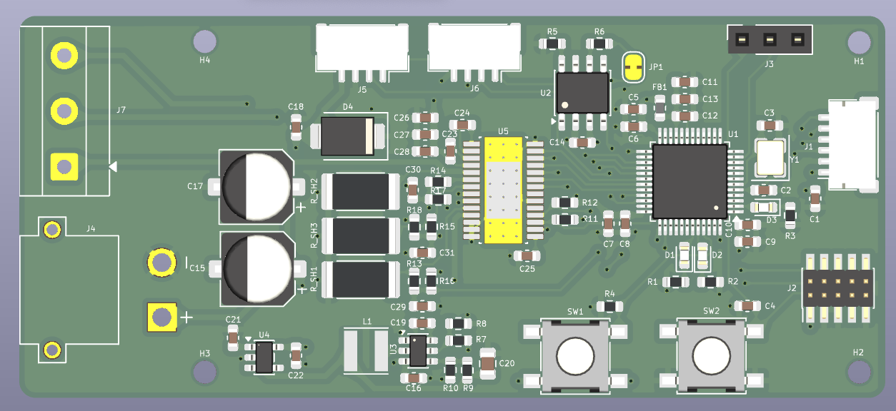
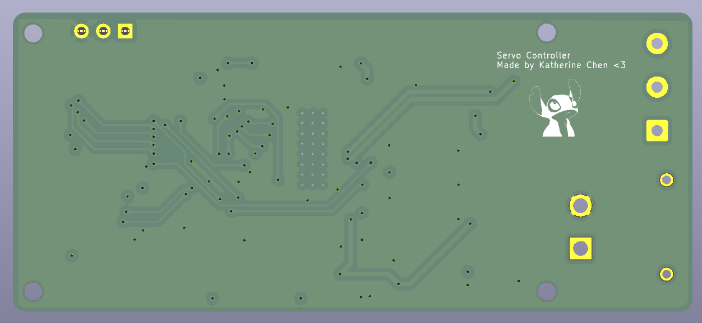
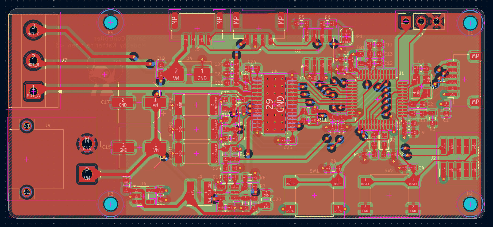

# field-oriented motor controller

A smart servo 79 × 35 mm PCB that mounts behind a gimbal-class brushless motor and turns it into a bus-connected robot joint. 

An STM32G431 runs field-oriented control (FOC) which measures each phase's current through 33 mΩ shunts on the driver's per-phase ground returns
(amplified by the MCU's internal op-amps), reads the rotor angle from an AS5047P 14-bit magnetic encoder over SPI, and drives a DRV8313 three-phase
driver with the PWM pattern that produces exactly the commanded torque. Velocity and position loops sit on top of the current loop, and everything is
commanded over CAN with paired daisy-chain connectors, so several joints share one bus and one power feed.

## Board Layout
 

## Design notes

**Rev A** -- Jul 22, 2026

Designed from the DRV8313 and STM32G431 datasheets with ST's B-G431B-ESC1 (UM2516) and mjbots moteus as references for the current-sense
network and CAN servo architecture. The schematic was verified by netlist audit and ERC before layout — notable bugs caught on the way: a UART_TX label
merged onto the reset net, sense networks bypassed on two of three phases, and swapped charge-pump/LDO bypass caps. Full build log and failure notes
coming with board bring-up.

## Status

I'm doing this because I want to learn about the mechatronics side of robotics. This will hopefully be developed into a PID project.
